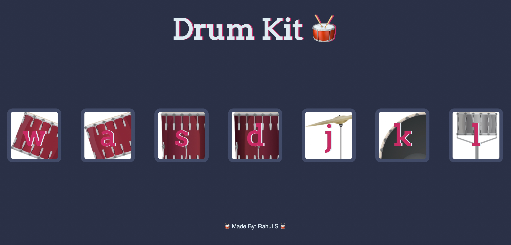
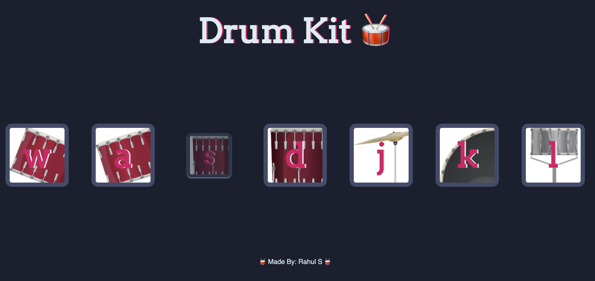

# Drum Kit 🥁 

&nbsp;&nbsp;&nbsp;&nbsp; A simple drum kit consists of a collection of drums, cymbals and other percussion instruments. These parts of the drum kit appear in website as separated buttons/images. Once the user clicks on a certain instrument of the drum kit, the button/img will dynamically play the appropriate sound along with a "zoom-in" and "fade" animation. This dynamic sound and animation will occur if the corresponding key is pressed as well. Thus interactiveness can be experienced using either 'mouse click' OR 'keyboard key press'.

&nbsp;&nbsp;&nbsp;&nbsp; This project was implemented with help of slightly more advanced **Document Object Model** (DOM) manipulation. DOM is a platform that allows programs/scripts to dynamically access and update the content, structure, and style of a document. The advanced JS and DOM manipulation allows the website to be interactive and NOT static.

## Deployment

Interact with Drum Kit website here --> Demo: [Drum Kit Website](https://rahuls1428.github.io/Drum-Kit/)

## Built With

  * HTML
  * CSS
  * JavaScript

## Authors

  * **Rahul Solaiappan**

## Acknowledgments

  * The Complete Web Development Bootcamp by Angela Yu
